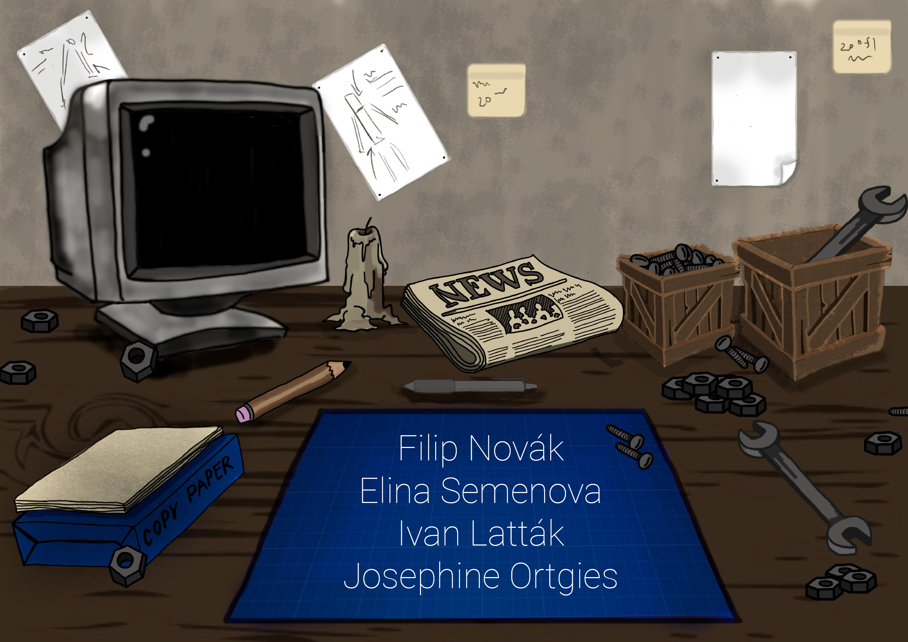

# About the Game

Robota - The Fourth Law is a satirical story-driven point & click puzzle game about constructing robots. Experience the dystopic world on the brink of radical change as you progress through four levels of a personal story of a man named Alex, who lost everything. Will you help him retain control? As you construct robots from scratch by building their physical appearance and determining their personality, you will explore different outcomes based on your choices.

